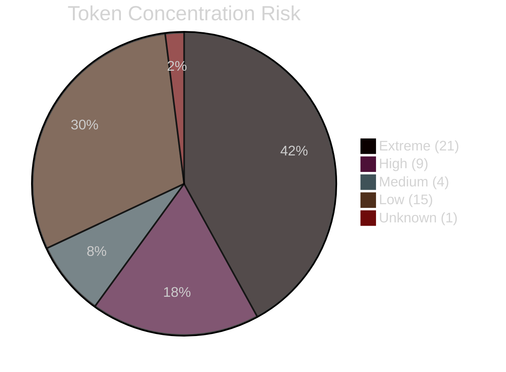
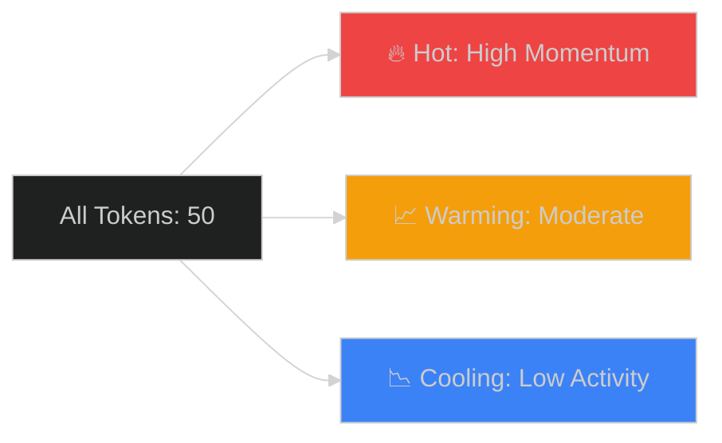
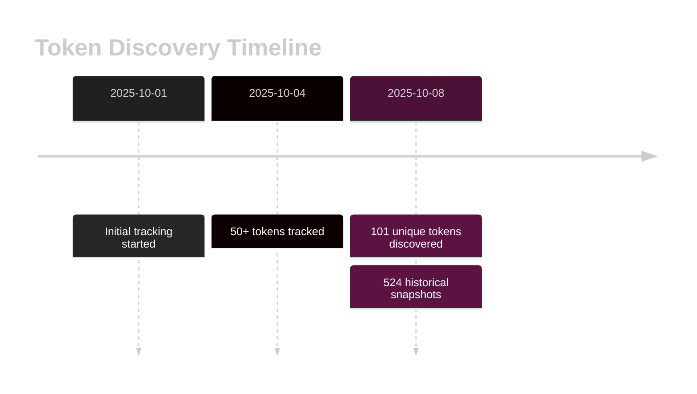

# 📊 Solana Radar - Daily Reports

**Last Updated**: 2025-10-08 22:01 UTC

**[🔍 View Interactive Dashboard →](https://stelios5791.github.io/sol-reports/)**

Automated daily analysis of Solana tokens with whale tracking and momentum indicators.

---

## 📈 Interactive Dashboard

Explore live data with our **[interactive dashboard](https://stelios5791.github.io/sol-reports/)** featuring:

- 📊 Real-time risk distribution & momentum charts
- 🔍 Token concentration analysis with historical trends
- 📉 Filterable token leaderboard with sorting
- 🎯 Click any token for detailed history & alerts
- 🔥 Volume momentum indicators (Hot/Warming/Cooling)

### Quick Stats

### Risk Distribution

**Legend:**
- 🔴 **Extreme Risk** (21 tokens): 99%+ holder concentration - High rug pull risk
- 🟠 **High Risk** (9 tokens): 90-99% concentration - Caution advised
- 🟡 **Medium Risk** (4 tokens): 70-90% concentration - Moderate decentralization
- 🟢 **Low Risk** (15 tokens): <70% concentration - Healthy distribution
- ⚪ **Unknown** (1 token): Insufficient holder data

---

## 🔥 Today's Top 50 Tokens

**Total Tokens**: 50
**Combined 24h Volume**: $342.58M
**Combined Liquidity**: $65.00M

**Concentration Risk Distribution**:
- 🔴 Extreme: 21 tokens
- 🟢 Low: 15 tokens
- 🟡 High: 9 tokens
- 🟢 Medium: 4 tokens
- 🟢 Unknown: 1 tokens

### Top 10 by Volume

| # | Symbol | Name | Volume 24h | Liquidity | Risk |
|---|--------|------|------------|-----------|------|
| 1 | wSOL | Wrapped SOL | $342.01M | $58.67M | 🟢 unknown |
| 2 | AI4 | AI⁴ | $155.95K | $99.86K | 🟢 low |
| 3 | DREAM | Dreamsync | $96.63K | $184.66K | 🟢 low |
| 4 | AI20X | Ai20x.ai | $90.87K | $2.74M | 🟢 low |
| 5 | RAGEGUY | Rage Guy | $88.27K | $147.32K | 🟢 low |
| 6 | LION | Loaded Lions | $49.14K | $2.11M | 🟢 low |
| 7 | HAROLD | Harold | $43.26K | $561.49K | 🟢 medium |
| 8 | 1nu | 1nu | $27.46K | $33.15K | 🟢 low |
| 9 | $CrepSol | Crepe on Solana | $6.00K | $27.74K | 🟢 low |
| 10 | SHITTER | SHITTERCOIN | $3.82K | $22.73K | 🟢 medium |

📄 [Full data: daily_top50.csv](data/daily_top50.csv)

---

## 🌱 New Viable Tokens (7-14 Days Old)

New tokens showing potential with healthy metrics and lower concentration risk.

**Found**: 5 viable new tokens

**Criteria**:
- First seen 7-14 days ago
- Volume > $50K
- Liquidity > $100K
- Missing streak < 2 (stable presence)
- Concentration risk: low/medium

| Symbol | Name | Age (days) | Volume 24h | Liquidity | Top 10% |
|--------|------|------------|------------|-----------|---------|
| wSOL | Wrapped SOL | 7 | $342.01M | $58.67M | 0.00% |
| DREAM | Dreamsync | 7 | $96.63K | $184.66K | 32.23% |
| AI20X | Ai20x.ai | 7 | $90.87K | $2.74M | 41.38% |
| RAGEGUY | Rage Guy | 7 | $88.27K | $147.32K | 27.40% |
| USDUT | unstable tether | 7 | $57.89K | $114.66K | 37.30% |

📄 [Full data: new_viable.csv](data/new_viable.csv)

---

## 🔥 Volume Momentum Analysis

Track tokens with elevated trading activity:

**Momentum Categories:**
- 🔥 **Hot**: Volume 2x+ above average (immediate attention)
- 📈 **Warming**: Volume above average (watch closely)
- 📉 **Cooling**: Volume below average (stable/declining)

> **Tip**: Check the [interactive dashboard](https://stelios5791.github.io/sol-reports/) to filter tokens by momentum and see historical trends!

---

## 📈 Top Movers (24h Change)

Tokens with significant price or volume changes in the last 24 hours.

**Total Movers**: 9
- 🚀 **Gainers** (>+20%): 1
- 📉 **Losers** (<-20%): 0
- 📊 **Volume Spikes** (>+100%): 9

### 🚀 Top Gainers

| # | Symbol | Name | Change 24h | Current Price | Volume Change | Risk |
|---|--------|------|------------|---------------|---------------|------|
| 1 | $CrepSol | Crepe on Solana | +51.73% | $0.00 | +229.2% | 🟢 |

📄 [Full data: top_movers.csv](data/top_movers.csv)

---

## 🎯 Trading Signals (Whale Filtered)

Signals filtered to exclude tokens with extreme concentration risk.

**Signal Distribution**:
- 👀 **Watch**: 5 tokens

### 👀 Watch List

*5 tokens showing elevated activity*

📄 [Full data: signals_filtered.csv](data/signals_filtered.csv)

---

## 📈 Historical Data

**Total Historical Records**: 524
**Unique Tokens Tracked**: 101
**Date Range**: 2025-10-01 to 2025-10-08

**Master Aggregations**: 101 tokens
**Performance Metrics**: 524 records

### Historical Trend

### Available Datasets

| File | Description | Records |
|------|-------------|---------|
| [history.csv](data/history.csv) | Complete historical snapshots | 524 |
| [master.csv](data/master.csv) | Aggregated per-token metrics | 101 |
| [performance.csv](data/performance.csv) | Rolling performance indicators | 524 |
| [daily_top50.csv](data/daily_top50.csv) | Today's top 50 tokens | 50 |
| [new_viable.csv](data/new_viable.csv) | New tokens with potential | 5 |
| [signals_filtered.csv](data/signals_filtered.csv) | Whale-filtered trading signals | 5 |

---

## 📋 Data Schema

### Key Columns

**Market Data**:
- `price_usd`: Current token price
- `volume_24h_usd`: 24-hour trading volume
- `liquidity_usd`: Total liquidity
- `fdv_usd`: Fully diluted valuation

**Whale Metrics (Holder Concentration)**:
- `top_10_holders_pct`: % held by top 10 wallets
- `top_5_holders_pct`: % held by top 5 wallets
- `holder_concentration`: Rating (critical/high/medium/low)
- `concentration_risk`: Risk level (extreme/high/medium/low)

**Performance Indicators**:
- `vol_mom_3v1`: 3-day vs 1-day volume momentum
- `zscore_vol_10d`: 10-day volume z-score
- `presence_7d`/`presence_30d`: Days seen in period
- `current_streak_days`: Consecutive days with data

---

## 🔗 Links

- **Interactive Dashboard**: [Live Dashboard](https://stelios5791.github.io/sol-reports/)
- **Data Repository**: [stelios5791/sol-reports](https://github.com/stelios5791/sol-reports)
- **Analysis Pipeline**: Private repository (automated daily)

---

## 💡 How to Use This Data

### For Traders
1. Check **Risk Distribution** to understand market safety
2. Filter **Low Risk** tokens on the dashboard
3. Monitor **Volume Momentum** for entry/exit signals
4. Review **Top Movers** for opportunities

### For Researchers
1. Download **history.csv** for time-series analysis
2. Use **performance.csv** for momentum backtesting
3. Analyze **master.csv** for token comparisons
4. Track **concentration trends** over time

### For Developers
1. Fork this repo and customize filters
2. Use CSV data in your own tools
3. Build alerts based on risk thresholds
4. Integrate with trading bots

---

*Generated automatically by Solana Radar pipeline*
*Dashboard updates in real-time | Data refreshes daily at 08:05 UTC*
