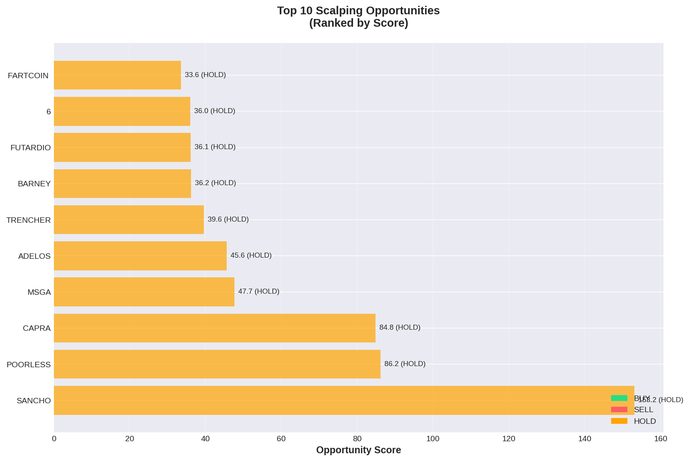
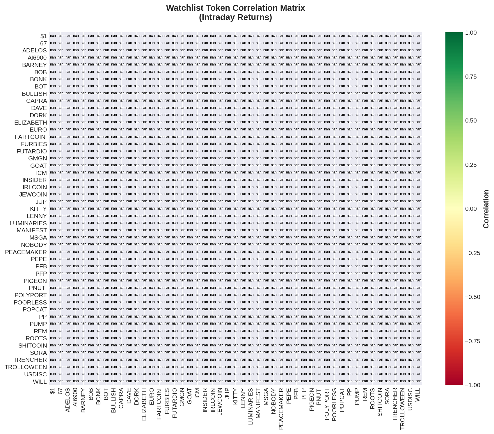

# Solana Scalping Analysis Report
**Date:** 2025-10-13  
**Generated:** 21:37 UTC

---

## 🎯 Top Opportunities

```
======================================================================
🎯 SCALPING OPPORTUNITIES - TODAY
======================================================================

✅ Loaded 34 snapshots (1242 datapoints)
📊 Top 20 tokens ranked by opportunity score:

 1. 🆕 SANCHO   🟡 HOLD 
    Price: $0.00004613
    Volatility: 144.9% | Momentum: +467.8% | Volume:    +0%
    Signal Strength: 0.0/5.0
    Score: 153.2

 2. 📌 ADELOS   🟡 HOLD 
    Price: $0.00149000
    Volatility:  49.8% | Momentum: +145.9% | Volume:   +14%
    Signal Strength: 0.0/5.0
    Score: 69.1

 3. 📌 JEWCOIN  🟡 HOLD ⭐⭐⭐
    Price: $0.00023580
    Volatility:   9.0% | Momentum:  +54.8% | Volume:    -2%
    Quality: 100/100 | Confluence: 2 indicators | R/R: 0.0:1
    Score: 49.4

 4. 📌 BOB      🟡 HOLD 
    Price: $0.00004796
    Volatility:  32.9% | Momentum:  -81.2% | Volume:    +9%
    Signal Strength: 0.0/5.0
    Score: 48.6

 5. 📌 PIGEON   🟡 HOLD ⭐⭐⭐
    Price: $0.00012920
    Volatility:  20.4% | Momentum:  +22.3% | Volume:   -14%
    Quality: 100/100 | Confluence: 2 indicators | R/R: 0.0:1
    Score: 44.0

 6. 📌 FUTARDIO 🟡 HOLD 
    Price: $0.00040580
    Volatility:  24.9% | Momentum:  +61.8% | Volume:   +17%
    Signal Strength: 0.0/5.0
    Score: 41.9

 7. 🆕 CAPRA    🟡 HOLD 
    Price: $0.00004402
    Volatility:  40.1% | Momentum: +123.3% | Volume:   -38%
    Signal Strength: 0.0/5.0
    Score: 40.3

 8. 📌 REM      🟡 HOLD ⭐⭐
    Price: $0.00016310
    Volatility:  13.4% | Momentum:  -22.1% | Volume:    -3%
    Signal Strength: 3.8/5.0
    Score: 38.2

 9. 📌 MANIFEST 🟡 HOLD ⭐⭐
    Price: $0.00000934
    Volatility:   5.1% | Momentum:  -29.9% | Volume:    +0%
    Signal Strength: 3.5/5.0
    Score: 37.5

10. 📌 INSIDER  🟡 HOLD 
    Price: $0.00001836
    Volatility:  23.3% | Momentum:  -42.8% | Volume:    +3%
    Signal Strength: 0.0/5.0
    Score: 36.6

11. 🆕 6        🟡 HOLD 
    Price: $0.00000957
    Volatility:  45.1% | Momentum:  -97.7% | Volume:   +21%
    Signal Strength: 0.0/5.0
    Score: 36.0

12. 📌 SHITCOIN 🟡 HOLD ⭐⭐⭐
    Price: $0.00110900
    Volatility:   2.6% | Momentum:  +11.2% | Volume:   +12%
    Signal Strength: 4.0/5.0
    Score: 33.6

13. 📌 POORLESS 🟡 HOLD 
    Price: $0.00005666
    Volatility:  14.3% | Momentum:  -35.0% | Volume:   +11%
    Signal Strength: 0.0/5.0
    Score: 32.5

14. 📌 ICM      🟡 HOLD 
    Price: $0.00037110
    Volatility:  12.2% | Momentum:  -36.9% | Volume:    -1%
    Signal Strength: 0.0/5.0
    Score: 32.3

15. 📌 FURBIES  🟡 HOLD 
    Price: $0.00036780
    Volatility:  17.8% | Momentum:  -30.4% | Volume:    +9%
    Signal Strength: 0.0/5.0
    Score: 32.2

16. 📌 PEACEMAK 🟡 HOLD 
    Price: $0.00029130
    Volatility:  24.4% | Momentum:  -21.5% | Volume:   +10%
    Signal Strength: 0.0/5.0
    Score: 31.6

17. 📌 GMGN     🟡 HOLD 
    Price: $0.00005351
    Volatility:  24.1% | Momentum:  +22.6% | Volume:    -6%
    Signal Strength: 0.0/5.0
    Score: 31.6

18. 📌 PEPE     🟡 HOLD ⭐⭐⭐
    Price: $0.00076890
    Volatility:   4.2% | Momentum:   +1.4% | Volume:   -46%
    Signal Strength: 4.2/5.0
    Score: 31.3

19. 📌 PUMP     🟡 HOLD ⭐⭐⭐
    Price: $0.00426400
    Volatility:   1.5% | Momentum:   +2.3% | Volume:    -5%
    Signal Strength: 4.0/5.0
    Score: 30.9

20. 📌 PNUT     🟡 HOLD ⭐⭐
    Price: $0.16140000
    Volatility:   0.8% | Momentum:   +3.5% | Volume:    +3%
    Signal Strength: 3.8/5.0
    Score: 30.5

======================================================================
Legend: 📌 Watchlist | 🆕 Dynamic | 🟢 Buy | 🔴 Sell | 🟡 Hold
======================================================================
```




---

## 📋 Watchlist Performance

```
======================================================================
📋 WATCHLIST PERFORMANCE - TODAY
======================================================================

✅ Loaded 34 snapshots (1242 datapoints)
📊 50 watchlist tokens tracked today:

🟢 TOP GAINERS
  ADELOS   +286.31% @ $0.00149000
  POORLESS +139.17% @ $0.00005666
  🟪        +118.55% @ $0.00031100
  FUTARDIO +114.82% @ $0.00040580
  PEACEMAK +86.25% @ $0.00029130

🔴 TOP LOSERS
  BOB      -77.18% @ $0.00004796
  MSGA     -86.72% @ $0.00000968
  MANIFEST -89.39% @ $0.00000934
  TRENCHER -92.58% @ $0.00000556
  AI6900   -94.30% @ $0.00001631

📈 STATS
  Average Change: +0.65%
  Median Change: -0.66%
  Gainers: 24
  Losers: 25

======================================================================
```

### Correlation Heatmap



---

## 🔬 Backtesting Results (7-day)

```
======================================================================
🔬 BACKTESTING WATCHLIST (7 days)
======================================================================

🔄 Backtesting 50 watchlist tokens...
  [1/50] Testing...
✅ Loaded 34 snapshots (1242 datapoints)
✅ Loaded 47 snapshots (493 datapoints)
✅ Loaded 14 snapshots (25 datapoints)
❌ No data for 2025-10-10
❌ No data for 2025-10-09
❌ No data for 2025-10-08
❌ No data for 2025-10-07
✅ Loaded 3 days of data: 2025-10-13 to 2025-10-11
  [2/50] Testing...
✅ Loaded 34 snapshots (1242 datapoints)
✅ Loaded 47 snapshots (493 datapoints)
✅ Loaded 14 snapshots (25 datapoints)
❌ No data for 2025-10-10
❌ No data for 2025-10-09
❌ No data for 2025-10-08
❌ No data for 2025-10-07
✅ Loaded 3 days of data: 2025-10-13 to 2025-10-11
  [3/50] Testing...
✅ Loaded 34 snapshots (1242 datapoints)
✅ Loaded 47 snapshots (493 datapoints)
✅ Loaded 14 snapshots (25 datapoints)
❌ No data for 2025-10-10
❌ No data for 2025-10-09
❌ No data for 2025-10-08
❌ No data for 2025-10-07
✅ Loaded 3 days of data: 2025-10-13 to 2025-10-11
  [4/50] Testing...
✅ Loaded 34 snapshots (1242 datapoints)
✅ Loaded 47 snapshots (493 datapoints)
✅ Loaded 14 snapshots (25 datapoints)
❌ No data for 2025-10-10
❌ No data for 2025-10-09
❌ No data for 2025-10-08
❌ No data for 2025-10-07
✅ Loaded 3 days of data: 2025-10-13 to 2025-10-11
  [5/50] Testing...
✅ Loaded 34 snapshots (1242 datapoints)
✅ Loaded 47 snapshots (493 datapoints)
✅ Loaded 14 snapshots (25 datapoints)
❌ No data for 2025-10-10
❌ No data for 2025-10-09
❌ No data for 2025-10-08
❌ No data for 2025-10-07
✅ Loaded 3 days of data: 2025-10-13 to 2025-10-11
  [6/50] Testing...
✅ Loaded 34 snapshots (1242 datapoints)
✅ Loaded 47 snapshots (493 datapoints)
✅ Loaded 14 snapshots (25 datapoints)
❌ No data for 2025-10-10
❌ No data for 2025-10-09
❌ No data for 2025-10-08
❌ No data for 2025-10-07
✅ Loaded 3 days of data: 2025-10-13 to 2025-10-11
  [7/50] Testing...
✅ Loaded 34 snapshots (1242 datapoints)
✅ Loaded 47 snapshots (493 datapoints)
✅ Loaded 14 snapshots (25 datapoints)
❌ No data for 2025-10-10
❌ No data for 2025-10-09
❌ No data for 2025-10-08
❌ No data for 2025-10-07
✅ Loaded 3 days of data: 2025-10-13 to 2025-10-11
  [8/50] Testing...
✅ Loaded 34 snapshots (1242 datapoints)
✅ Loaded 47 snapshots (493 datapoints)
✅ Loaded 14 snapshots (25 datapoints)
❌ No data for 2025-10-10
❌ No data for 2025-10-09
❌ No data for 2025-10-08
❌ No data for 2025-10-07
✅ Loaded 3 days of data: 2025-10-13 to 2025-10-11
  [9/50] Testing...
✅ Loaded 34 snapshots (1242 datapoints)
✅ Loaded 47 snapshots (493 datapoints)
✅ Loaded 14 snapshots (25 datapoints)
❌ No data for 2025-10-10
❌ No data for 2025-10-09
❌ No data for 2025-10-08
❌ No data for 2025-10-07
✅ Loaded 3 days of data: 2025-10-13 to 2025-10-11
  [10/50] Testing...
✅ Loaded 34 snapshots (1242 datapoints)
✅ Loaded 47 snapshots (493 datapoints)
✅ Loaded 14 snapshots (25 datapoints)
❌ No data for 2025-10-10
❌ No data for 2025-10-09
❌ No data for 2025-10-08
❌ No data for 2025-10-07
✅ Loaded 3 days of data: 2025-10-13 to 2025-10-11
  [11/50] Testing...
✅ Loaded 34 snapshots (1242 datapoints)
✅ Loaded 47 snapshots (493 datapoints)
✅ Loaded 14 snapshots (25 datapoints)
❌ No data for 2025-10-10
❌ No data for 2025-10-09
❌ No data for 2025-10-08
❌ No data for 2025-10-07
✅ Loaded 3 days of data: 2025-10-13 to 2025-10-11
  [12/50] Testing...
✅ Loaded 34 snapshots (1242 datapoints)
✅ Loaded 47 snapshots (493 datapoints)
✅ Loaded 14 snapshots (25 datapoints)
❌ No data for 2025-10-10
❌ No data for 2025-10-09
❌ No data for 2025-10-08
❌ No data for 2025-10-07
✅ Loaded 3 days of data: 2025-10-13 to 2025-10-11
  [13/50] Testing...
✅ Loaded 34 snapshots (1242 datapoints)
✅ Loaded 47 snapshots (493 datapoints)
✅ Loaded 14 snapshots (25 datapoints)
❌ No data for 2025-10-10
❌ No data for 2025-10-09
❌ No data for 2025-10-08
❌ No data for 2025-10-07
✅ Loaded 3 days of data: 2025-10-13 to 2025-10-11
  [14/50] Testing...
✅ Loaded 34 snapshots (1242 datapoints)
✅ Loaded 47 snapshots (493 datapoints)
✅ Loaded 14 snapshots (25 datapoints)
❌ No data for 2025-10-10
❌ No data for 2025-10-09
❌ No data for 2025-10-08
❌ No data for 2025-10-07
✅ Loaded 3 days of data: 2025-10-13 to 2025-10-11
  [15/50] Testing...
✅ Loaded 34 snapshots (1242 datapoints)
✅ Loaded 47 snapshots (493 datapoints)
✅ Loaded 14 snapshots (25 datapoints)
❌ No data for 2025-10-10
❌ No data for 2025-10-09
❌ No data for 2025-10-08
❌ No data for 2025-10-07
✅ Loaded 3 days of data: 2025-10-13 to 2025-10-11
  [16/50] Testing...
✅ Loaded 34 snapshots (1242 datapoints)
✅ Loaded 47 snapshots (493 datapoints)
✅ Loaded 14 snapshots (25 datapoints)
❌ No data for 2025-10-10
❌ No data for 2025-10-09
❌ No data for 2025-10-08
❌ No data for 2025-10-07
✅ Loaded 3 days of data: 2025-10-13 to 2025-10-11
  [17/50] Testing...
✅ Loaded 34 snapshots (1242 datapoints)
✅ Loaded 47 snapshots (493 datapoints)
✅ Loaded 14 snapshots (25 datapoints)
❌ No data for 2025-10-10
❌ No data for 2025-10-09
❌ No data for 2025-10-08
❌ No data for 2025-10-07
✅ Loaded 3 days of data: 2025-10-13 to 2025-10-11
  [18/50] Testing...
✅ Loaded 34 snapshots (1242 datapoints)
✅ Loaded 47 snapshots (493 datapoints)
✅ Loaded 14 snapshots (25 datapoints)
❌ No data for 2025-10-10
❌ No data for 2025-10-09
❌ No data for 2025-10-08
❌ No data for 2025-10-07
✅ Loaded 3 days of data: 2025-10-13 to 2025-10-11
  [19/50] Testing...
✅ Loaded 34 snapshots (1242 datapoints)
✅ Loaded 47 snapshots (493 datapoints)
✅ Loaded 14 snapshots (25 datapoints)
❌ No data for 2025-10-10
❌ No data for 2025-10-09
❌ No data for 2025-10-08
❌ No data for 2025-10-07
✅ Loaded 3 days of data: 2025-10-13 to 2025-10-11
  [20/50] Testing...
✅ Loaded 34 snapshots (1242 datapoints)
✅ Loaded 47 snapshots (493 datapoints)
✅ Loaded 14 snapshots (25 datapoints)
❌ No data for 2025-10-10
❌ No data for 2025-10-09
❌ No data for 2025-10-08
❌ No data for 2025-10-07
✅ Loaded 3 days of data: 2025-10-13 to 2025-10-11
  [21/50] Testing...
✅ Loaded 34 snapshots (1242 datapoints)
✅ Loaded 47 snapshots (493 datapoints)
✅ Loaded 14 snapshots (25 datapoints)
❌ No data for 2025-10-10
❌ No data for 2025-10-09
❌ No data for 2025-10-08
❌ No data for 2025-10-07
✅ Loaded 3 days of data: 2025-10-13 to 2025-10-11
  [22/50] Testing...
✅ Loaded 34 snapshots (1242 datapoints)
✅ Loaded 47 snapshots (493 datapoints)
✅ Loaded 14 snapshots (25 datapoints)
❌ No data for 2025-10-10
❌ No data for 2025-10-09
❌ No data for 2025-10-08
❌ No data for 2025-10-07
✅ Loaded 3 days of data: 2025-10-13 to 2025-10-11
  [23/50] Testing...
✅ Loaded 34 snapshots (1242 datapoints)
✅ Loaded 47 snapshots (493 datapoints)
✅ Loaded 14 snapshots (25 datapoints)
❌ No data for 2025-10-10
❌ No data for 2025-10-09
❌ No data for 2025-10-08
❌ No data for 2025-10-07
✅ Loaded 3 days of data: 2025-10-13 to 2025-10-11
  [24/50] Testing...
✅ Loaded 34 snapshots (1242 datapoints)
✅ Loaded 47 snapshots (493 datapoints)
✅ Loaded 14 snapshots (25 datapoints)
❌ No data for 2025-10-10
❌ No data for 2025-10-09
❌ No data for 2025-10-08
❌ No data for 2025-10-07
✅ Loaded 3 days of data: 2025-10-13 to 2025-10-11
  [25/50] Testing...
✅ Loaded 34 snapshots (1242 datapoints)
✅ Loaded 47 snapshots (493 datapoints)
✅ Loaded 14 snapshots (25 datapoints)
❌ No data for 2025-10-10
❌ No data for 2025-10-09
❌ No data for 2025-10-08
❌ No data for 2025-10-07
✅ Loaded 3 days of data: 2025-10-13 to 2025-10-11
  [26/50] Testing...
✅ Loaded 34 snapshots (1242 datapoints)
✅ Loaded 47 snapshots (493 datapoints)
✅ Loaded 14 snapshots (25 datapoints)
❌ No data for 2025-10-10
❌ No data for 2025-10-09
❌ No data for 2025-10-08
❌ No data for 2025-10-07
✅ Loaded 3 days of data: 2025-10-13 to 2025-10-11
  [27/50] Testing...
✅ Loaded 34 snapshots (1242 datapoints)
✅ Loaded 47 snapshots (493 datapoints)
✅ Loaded 14 snapshots (25 datapoints)
❌ No data for 2025-10-10
❌ No data for 2025-10-09
❌ No data for 2025-10-08
❌ No data for 2025-10-07
✅ Loaded 3 days of data: 2025-10-13 to 2025-10-11
  [28/50] Testing...
✅ Loaded 34 snapshots (1242 datapoints)
✅ Loaded 47 snapshots (493 datapoints)
✅ Loaded 14 snapshots (25 datapoints)
❌ No data for 2025-10-10
❌ No data for 2025-10-09
❌ No data for 2025-10-08
❌ No data for 2025-10-07
✅ Loaded 3 days of data: 2025-10-13 to 2025-10-11
  [29/50] Testing...
✅ Loaded 34 snapshots (1242 datapoints)
✅ Loaded 47 snapshots (493 datapoints)
✅ Loaded 14 snapshots (25 datapoints)
❌ No data for 2025-10-10
❌ No data for 2025-10-09
❌ No data for 2025-10-08
❌ No data for 2025-10-07
✅ Loaded 3 days of data: 2025-10-13 to 2025-10-11
  [30/50] Testing...
✅ Loaded 34 snapshots (1242 datapoints)
✅ Loaded 47 snapshots (493 datapoints)
✅ Loaded 14 snapshots (25 datapoints)
❌ No data for 2025-10-10
❌ No data for 2025-10-09
❌ No data for 2025-10-08
❌ No data for 2025-10-07
✅ Loaded 3 days of data: 2025-10-13 to 2025-10-11
  [31/50] Testing...
✅ Loaded 34 snapshots (1242 datapoints)
✅ Loaded 47 snapshots (493 datapoints)
✅ Loaded 14 snapshots (25 datapoints)
❌ No data for 2025-10-10
❌ No data for 2025-10-09
❌ No data for 2025-10-08
❌ No data for 2025-10-07
✅ Loaded 3 days of data: 2025-10-13 to 2025-10-11
  [32/50] Testing...
✅ Loaded 34 snapshots (1242 datapoints)
✅ Loaded 47 snapshots (493 datapoints)
✅ Loaded 14 snapshots (25 datapoints)
❌ No data for 2025-10-10
❌ No data for 2025-10-09
❌ No data for 2025-10-08
❌ No data for 2025-10-07
✅ Loaded 3 days of data: 2025-10-13 to 2025-10-11
  [33/50] Testing...
✅ Loaded 34 snapshots (1242 datapoints)
✅ Loaded 47 snapshots (493 datapoints)
✅ Loaded 14 snapshots (25 datapoints)
❌ No data for 2025-10-10
❌ No data for 2025-10-09
❌ No data for 2025-10-08
❌ No data for 2025-10-07
✅ Loaded 3 days of data: 2025-10-13 to 2025-10-11
  [34/50] Testing...
✅ Loaded 34 snapshots (1242 datapoints)
✅ Loaded 47 snapshots (493 datapoints)
✅ Loaded 14 snapshots (25 datapoints)
❌ No data for 2025-10-10
❌ No data for 2025-10-09
❌ No data for 2025-10-08
❌ No data for 2025-10-07
✅ Loaded 3 days of data: 2025-10-13 to 2025-10-11
  [35/50] Testing...
✅ Loaded 34 snapshots (1242 datapoints)
✅ Loaded 47 snapshots (493 datapoints)
✅ Loaded 14 snapshots (25 datapoints)
❌ No data for 2025-10-10
❌ No data for 2025-10-09
❌ No data for 2025-10-08
❌ No data for 2025-10-07
✅ Loaded 3 days of data: 2025-10-13 to 2025-10-11
  [36/50] Testing...
✅ Loaded 34 snapshots (1242 datapoints)
✅ Loaded 47 snapshots (493 datapoints)
✅ Loaded 14 snapshots (25 datapoints)
❌ No data for 2025-10-10
❌ No data for 2025-10-09
❌ No data for 2025-10-08
❌ No data for 2025-10-07
✅ Loaded 3 days of data: 2025-10-13 to 2025-10-11
  [37/50] Testing...
✅ Loaded 34 snapshots (1242 datapoints)
✅ Loaded 47 snapshots (493 datapoints)
✅ Loaded 14 snapshots (25 datapoints)
❌ No data for 2025-10-10
❌ No data for 2025-10-09
❌ No data for 2025-10-08
❌ No data for 2025-10-07
✅ Loaded 3 days of data: 2025-10-13 to 2025-10-11
  [38/50] Testing...
✅ Loaded 34 snapshots (1242 datapoints)
✅ Loaded 47 snapshots (493 datapoints)
✅ Loaded 14 snapshots (25 datapoints)
❌ No data for 2025-10-10
❌ No data for 2025-10-09
❌ No data for 2025-10-08
❌ No data for 2025-10-07
✅ Loaded 3 days of data: 2025-10-13 to 2025-10-11
  [39/50] Testing...
✅ Loaded 34 snapshots (1242 datapoints)
✅ Loaded 47 snapshots (493 datapoints)
✅ Loaded 14 snapshots (25 datapoints)
❌ No data for 2025-10-10
❌ No data for 2025-10-09
❌ No data for 2025-10-08
❌ No data for 2025-10-07
✅ Loaded 3 days of data: 2025-10-13 to 2025-10-11
  [40/50] Testing...
✅ Loaded 34 snapshots (1242 datapoints)
✅ Loaded 47 snapshots (493 datapoints)
✅ Loaded 14 snapshots (25 datapoints)
❌ No data for 2025-10-10
❌ No data for 2025-10-09
❌ No data for 2025-10-08
❌ No data for 2025-10-07
✅ Loaded 3 days of data: 2025-10-13 to 2025-10-11
  [41/50] Testing...
✅ Loaded 34 snapshots (1242 datapoints)
✅ Loaded 47 snapshots (493 datapoints)
✅ Loaded 14 snapshots (25 datapoints)
❌ No data for 2025-10-10
❌ No data for 2025-10-09
❌ No data for 2025-10-08
❌ No data for 2025-10-07
✅ Loaded 3 days of data: 2025-10-13 to 2025-10-11
  [42/50] Testing...
✅ Loaded 34 snapshots (1242 datapoints)
✅ Loaded 47 snapshots (493 datapoints)
✅ Loaded 14 snapshots (25 datapoints)
❌ No data for 2025-10-10
❌ No data for 2025-10-09
❌ No data for 2025-10-08
❌ No data for 2025-10-07
✅ Loaded 3 days of data: 2025-10-13 to 2025-10-11
  [43/50] Testing...
✅ Loaded 34 snapshots (1242 datapoints)
✅ Loaded 47 snapshots (493 datapoints)
✅ Loaded 14 snapshots (25 datapoints)
❌ No data for 2025-10-10
❌ No data for 2025-10-09
❌ No data for 2025-10-08
❌ No data for 2025-10-07
✅ Loaded 3 days of data: 2025-10-13 to 2025-10-11
  [44/50] Testing...
✅ Loaded 34 snapshots (1242 datapoints)
✅ Loaded 47 snapshots (493 datapoints)
✅ Loaded 14 snapshots (25 datapoints)
❌ No data for 2025-10-10
❌ No data for 2025-10-09
❌ No data for 2025-10-08
❌ No data for 2025-10-07
✅ Loaded 3 days of data: 2025-10-13 to 2025-10-11
  [45/50] Testing...
✅ Loaded 34 snapshots (1242 datapoints)
✅ Loaded 47 snapshots (493 datapoints)
✅ Loaded 14 snapshots (25 datapoints)
❌ No data for 2025-10-10
❌ No data for 2025-10-09
❌ No data for 2025-10-08
❌ No data for 2025-10-07
✅ Loaded 3 days of data: 2025-10-13 to 2025-10-11
  [46/50] Testing...
✅ Loaded 34 snapshots (1242 datapoints)
✅ Loaded 47 snapshots (493 datapoints)
✅ Loaded 14 snapshots (25 datapoints)
❌ No data for 2025-10-10
❌ No data for 2025-10-09
❌ No data for 2025-10-08
❌ No data for 2025-10-07
✅ Loaded 3 days of data: 2025-10-13 to 2025-10-11
  [47/50] Testing...
✅ Loaded 34 snapshots (1242 datapoints)
✅ Loaded 47 snapshots (493 datapoints)
✅ Loaded 14 snapshots (25 datapoints)
❌ No data for 2025-10-10
❌ No data for 2025-10-09
❌ No data for 2025-10-08
❌ No data for 2025-10-07
✅ Loaded 3 days of data: 2025-10-13 to 2025-10-11
  [48/50] Testing...
✅ Loaded 34 snapshots (1242 datapoints)
✅ Loaded 47 snapshots (493 datapoints)
✅ Loaded 14 snapshots (25 datapoints)
❌ No data for 2025-10-10
❌ No data for 2025-10-09
❌ No data for 2025-10-08
❌ No data for 2025-10-07
✅ Loaded 3 days of data: 2025-10-13 to 2025-10-11
  [49/50] Testing...
✅ Loaded 34 snapshots (1242 datapoints)
✅ Loaded 47 snapshots (493 datapoints)
✅ Loaded 14 snapshots (25 datapoints)
❌ No data for 2025-10-10
❌ No data for 2025-10-09
❌ No data for 2025-10-08
❌ No data for 2025-10-07
✅ Loaded 3 days of data: 2025-10-13 to 2025-10-11
  [50/50] Testing...
✅ Loaded 34 snapshots (1242 datapoints)
✅ Loaded 47 snapshots (493 datapoints)
✅ Loaded 14 snapshots (25 datapoints)
❌ No data for 2025-10-10
❌ No data for 2025-10-09
❌ No data for 2025-10-08
❌ No data for 2025-10-07
✅ Loaded 3 days of data: 2025-10-13 to 2025-10-11

❌ No backtest results
❌ No results
```


---

## 📊 How to Use

### Signal Interpretation
- 🟢 **BUY**: High volatility + positive momentum + volume surge
- 🔴 **SELL**: Momentum reversal or volume decline
- 🟡 **HOLD**: Low volatility or neutral conditions

### Signal Strength
- **0-2**: Weak signal, high risk
- **2-3**: Moderate signal, medium risk
- **3-4**: Strong signal, lower risk
- **4-5**: Very strong signal, best opportunities

### Opportunity Score
Composite score based on:
- Volatility (30%)
- Momentum (30%)
- Volume (20%)
- Signal strength (20%)
- Watchlist bonus (+20 if tracked)

### Recommendations
1. Focus on watchlist tokens (📌) - more reliable data
2. Look for signal strength ≥3.0
3. Confirm with volume momentum
4. Check support/resistance levels before entry

---

**Next Update:** In 30 minutes  
**Data Source:** [Intraday Snapshots](https://github.com/stelios5791/sol-reports/tree/main/intraday)
