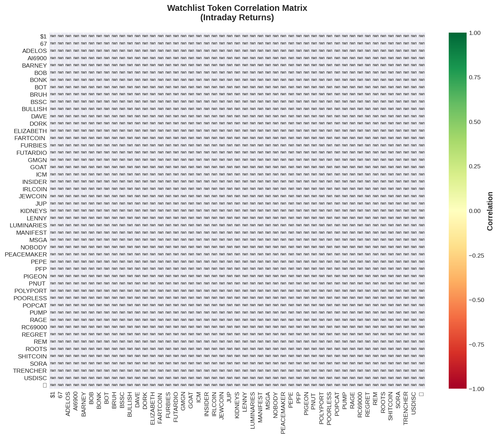

# Solana Scalping Analysis Report
**Date:** 2025-10-13  
**Generated:** 22:17 UTC

---

## 🎯 Top Opportunities

```
======================================================================
🎯 SCALPING OPPORTUNITIES - TODAY
======================================================================

✅ Loaded 35 snapshots (1299 datapoints)
📊 Top 20 tokens ranked by opportunity score:

 1. 🆕 SANCHO   🟡 HOLD 
    Price: $0.00004613
    Volatility: 144.9% | Momentum: +467.8% | Volume:    +0%
    Signal Strength: 0.0/5.0
    Score: 153.2

 2. 📌 ADELOS   🟡 HOLD 
    Price: $0.00190300
    Volatility:  48.9% | Momentum: +116.6% | Volume:   +12%
    Signal Strength: 0.0/5.0
    Score: 61.6

 3. 📌 FUTARDIO 🟡 HOLD 
    Price: $0.00049220
    Volatility:  25.2% | Momentum:  +80.2% | Volume:   +23%
    Signal Strength: 0.0/5.0
    Score: 46.7

 4. 📌 BOB      🟡 HOLD 
    Price: $0.00004790
    Volatility:  32.4% | Momentum:  -70.6% | Volume:    +5%
    Signal Strength: 0.0/5.0
    Score: 45.8

 5. 🆕 CAPRA    🟡 HOLD 
    Price: $0.00004402
    Volatility:  40.1% | Momentum: +123.3% | Volume:   -38%
    Signal Strength: 0.0/5.0
    Score: 40.3

 6. 📌 REM      🟡 HOLD ⭐⭐⭐
    Price: $0.00015890
    Volatility:  13.4% | Momentum:  -20.9% | Volume:    -5%
    Signal Strength: 4.3/5.0
    Score: 39.4

 7. 📌 INSIDER  🟡 HOLD 
    Price: $0.00001667
    Volatility:  17.0% | Momentum:  -58.8% | Volume:    +2%
    Signal Strength: 0.0/5.0
    Score: 39.0

 8. 📌 JEWCOIN  🟡 HOLD ⭐⭐⭐
    Price: $0.00021680
    Volatility:   9.6% | Momentum:  +21.5% | Volume:    -4%
    Signal Strength: 4.1/5.0
    Score: 38.0

 9. 📌 MANIFEST 🟡 HOLD ⭐⭐⭐
    Price: $0.00001023
    Volatility:   7.9% | Momentum:  -17.4% | Volume:    +0%
    Signal Strength: 4.1/5.0
    Score: 36.6

10. 📌 SHITCOIN 🟡 HOLD ⭐⭐⭐
    Price: $0.00116300
    Volatility:   2.8% | Momentum:  +12.6% | Volume:    +8%
    Signal Strength: 4.8/5.0
    Score: 36.1

11. 🆕 6        🟡 HOLD 
    Price: $0.00000957
    Volatility:  45.1% | Momentum:  -97.7% | Volume:   +21%
    Signal Strength: 0.0/5.0
    Score: 36.0

12. 📌 PEACEMAK 🟡 HOLD 
    Price: $0.00026490
    Volatility:  24.0% | Momentum:  -33.7% | Volume:    +9%
    Signal Strength: 0.0/5.0
    Score: 34.6

13. 📌 ROOTS    🟡 HOLD 
    Price: $0.00034810
    Volatility:  26.7% | Momentum:  +30.3% | Volume:   -14%
    Signal Strength: 0.0/5.0
    Score: 34.0

14. 📌 MSGA     🟡 HOLD 
    Price: $0.00000729
    Volatility:  11.0% | Momentum:  -43.0% | Volume:    +2%
    Signal Strength: 0.0/5.0
    Score: 33.5

15. 📌 LUMINARI 🟡 HOLD 
    Price: $0.00007790
    Volatility:  11.7% | Momentum:  -41.6% | Volume:    +4%
    Signal Strength: 0.0/5.0
    Score: 33.4

16. 📌 PIGEON   🟡 HOLD ⭐⭐
    Price: $0.00012310
    Volatility:  19.9% | Momentum:   +0.4% | Volume:   -12%
    Signal Strength: 3.2/5.0
    Score: 33.0

17. 📌 DAVE     🟡 HOLD 
    Price: $0.00022360
    Volatility:  17.3% | Momentum:  +32.9% | Volume:    -3%
    Signal Strength: 0.0/5.0
    Score: 32.5

18. 📌 POORLESS 🟡 HOLD 
    Price: $0.00006849
    Volatility:  16.6% | Momentum:  -30.5% | Volume:    +8%
    Signal Strength: 0.0/5.0
    Score: 31.9

19. 📌 PEPE     🟡 HOLD ⭐⭐
    Price: $0.00079830
    Volatility:   3.5% | Momentum:  +10.6% | Volume:   -39%
    Signal Strength: 3.5/5.0
    Score: 31.7

20. 📌 TRENCHER 🟡 HOLD ⭐⭐
    Price: $0.00000556
    Volatility:   2.9% | Momentum:   +5.3% | Volume:    +0%
    Signal Strength: 3.2/5.0
    Score: 30.2

======================================================================
Legend: 📌 Watchlist | 🆕 Dynamic | 🟢 Buy | 🔴 Sell | 🟡 Hold
======================================================================
```


---

## 📋 Watchlist Performance

```
======================================================================
📋 WATCHLIST PERFORMANCE - TODAY
======================================================================

✅ Loaded 35 snapshots (1299 datapoints)
📊 50 watchlist tokens tracked today:

🟢 TOP GAINERS
  ADELOS   +393.39% @ $0.00190300
  POORLESS +189.11% @ $0.00006849
  FUTARDIO +160.56% @ $0.00049220
  🟪        +105.76% @ $0.00029280
  PEACEMAK +69.37% @ $0.00026490

🔴 TOP LOSERS
  BOB      -77.21% @ $0.00004790
  MANIFEST -88.38% @ $0.00001023
  MSGA     -90.00% @ $0.00000729
  TRENCHER -92.58% @ $0.00000556
  AI6900   -94.34% @ $0.00001619

📈 STATS
  Average Change: +3.01%
  Median Change: -0.85%
  Gainers: 24
  Losers: 25

======================================================================
```

### Correlation Heatmap



---

## 🔬 Backtesting Results (7-day)

```
======================================================================
🔬 BACKTESTING WATCHLIST (7 days)
======================================================================

🔄 Backtesting 50 watchlist tokens...
  [1/50] Testing...
✅ Loaded 35 snapshots (1299 datapoints)
✅ Loaded 47 snapshots (493 datapoints)
✅ Loaded 14 snapshots (25 datapoints)
❌ No data for 2025-10-10
❌ No data for 2025-10-09
❌ No data for 2025-10-08
❌ No data for 2025-10-07
✅ Loaded 3 days of data: 2025-10-13 to 2025-10-11
  [2/50] Testing...
✅ Loaded 35 snapshots (1299 datapoints)
✅ Loaded 47 snapshots (493 datapoints)
✅ Loaded 14 snapshots (25 datapoints)
❌ No data for 2025-10-10
❌ No data for 2025-10-09
❌ No data for 2025-10-08
❌ No data for 2025-10-07
✅ Loaded 3 days of data: 2025-10-13 to 2025-10-11
  [3/50] Testing...
✅ Loaded 35 snapshots (1299 datapoints)
✅ Loaded 47 snapshots (493 datapoints)
✅ Loaded 14 snapshots (25 datapoints)
❌ No data for 2025-10-10
❌ No data for 2025-10-09
❌ No data for 2025-10-08
❌ No data for 2025-10-07
✅ Loaded 3 days of data: 2025-10-13 to 2025-10-11
  [4/50] Testing...
✅ Loaded 35 snapshots (1299 datapoints)
✅ Loaded 47 snapshots (493 datapoints)
✅ Loaded 14 snapshots (25 datapoints)
❌ No data for 2025-10-10
❌ No data for 2025-10-09
❌ No data for 2025-10-08
❌ No data for 2025-10-07
✅ Loaded 3 days of data: 2025-10-13 to 2025-10-11
  [5/50] Testing...
✅ Loaded 35 snapshots (1299 datapoints)
✅ Loaded 47 snapshots (493 datapoints)
✅ Loaded 14 snapshots (25 datapoints)
❌ No data for 2025-10-10
❌ No data for 2025-10-09
❌ No data for 2025-10-08
❌ No data for 2025-10-07
✅ Loaded 3 days of data: 2025-10-13 to 2025-10-11
  [6/50] Testing...
✅ Loaded 35 snapshots (1299 datapoints)
✅ Loaded 47 snapshots (493 datapoints)
✅ Loaded 14 snapshots (25 datapoints)
❌ No data for 2025-10-10
❌ No data for 2025-10-09
❌ No data for 2025-10-08
❌ No data for 2025-10-07
✅ Loaded 3 days of data: 2025-10-13 to 2025-10-11
  [7/50] Testing...
✅ Loaded 35 snapshots (1299 datapoints)
✅ Loaded 47 snapshots (493 datapoints)
✅ Loaded 14 snapshots (25 datapoints)
❌ No data for 2025-10-10
❌ No data for 2025-10-09
❌ No data for 2025-10-08
❌ No data for 2025-10-07
✅ Loaded 3 days of data: 2025-10-13 to 2025-10-11
  [8/50] Testing...
✅ Loaded 35 snapshots (1299 datapoints)
✅ Loaded 47 snapshots (493 datapoints)
✅ Loaded 14 snapshots (25 datapoints)
❌ No data for 2025-10-10
❌ No data for 2025-10-09
❌ No data for 2025-10-08
❌ No data for 2025-10-07
✅ Loaded 3 days of data: 2025-10-13 to 2025-10-11
  [9/50] Testing...
✅ Loaded 35 snapshots (1299 datapoints)
✅ Loaded 47 snapshots (493 datapoints)
✅ Loaded 14 snapshots (25 datapoints)
❌ No data for 2025-10-10
❌ No data for 2025-10-09
❌ No data for 2025-10-08
❌ No data for 2025-10-07
✅ Loaded 3 days of data: 2025-10-13 to 2025-10-11
  [10/50] Testing...
✅ Loaded 35 snapshots (1299 datapoints)
✅ Loaded 47 snapshots (493 datapoints)
✅ Loaded 14 snapshots (25 datapoints)
❌ No data for 2025-10-10
❌ No data for 2025-10-09
❌ No data for 2025-10-08
❌ No data for 2025-10-07
✅ Loaded 3 days of data: 2025-10-13 to 2025-10-11
  [11/50] Testing...
✅ Loaded 35 snapshots (1299 datapoints)
✅ Loaded 47 snapshots (493 datapoints)
✅ Loaded 14 snapshots (25 datapoints)
❌ No data for 2025-10-10
❌ No data for 2025-10-09
❌ No data for 2025-10-08
❌ No data for 2025-10-07
✅ Loaded 3 days of data: 2025-10-13 to 2025-10-11
  [12/50] Testing...
✅ Loaded 35 snapshots (1299 datapoints)
✅ Loaded 47 snapshots (493 datapoints)
✅ Loaded 14 snapshots (25 datapoints)
❌ No data for 2025-10-10
❌ No data for 2025-10-09
❌ No data for 2025-10-08
❌ No data for 2025-10-07
✅ Loaded 3 days of data: 2025-10-13 to 2025-10-11
  [13/50] Testing...
✅ Loaded 35 snapshots (1299 datapoints)
✅ Loaded 47 snapshots (493 datapoints)
✅ Loaded 14 snapshots (25 datapoints)
❌ No data for 2025-10-10
❌ No data for 2025-10-09
❌ No data for 2025-10-08
❌ No data for 2025-10-07
✅ Loaded 3 days of data: 2025-10-13 to 2025-10-11
  [14/50] Testing...
✅ Loaded 35 snapshots (1299 datapoints)
✅ Loaded 47 snapshots (493 datapoints)
✅ Loaded 14 snapshots (25 datapoints)
❌ No data for 2025-10-10
❌ No data for 2025-10-09
❌ No data for 2025-10-08
❌ No data for 2025-10-07
✅ Loaded 3 days of data: 2025-10-13 to 2025-10-11
  [15/50] Testing...
✅ Loaded 35 snapshots (1299 datapoints)
✅ Loaded 47 snapshots (493 datapoints)
✅ Loaded 14 snapshots (25 datapoints)
❌ No data for 2025-10-10
❌ No data for 2025-10-09
❌ No data for 2025-10-08
❌ No data for 2025-10-07
✅ Loaded 3 days of data: 2025-10-13 to 2025-10-11
  [16/50] Testing...
✅ Loaded 35 snapshots (1299 datapoints)
✅ Loaded 47 snapshots (493 datapoints)
✅ Loaded 14 snapshots (25 datapoints)
❌ No data for 2025-10-10
❌ No data for 2025-10-09
❌ No data for 2025-10-08
❌ No data for 2025-10-07
✅ Loaded 3 days of data: 2025-10-13 to 2025-10-11
  [17/50] Testing...
✅ Loaded 35 snapshots (1299 datapoints)
✅ Loaded 47 snapshots (493 datapoints)
✅ Loaded 14 snapshots (25 datapoints)
❌ No data for 2025-10-10
❌ No data for 2025-10-09
❌ No data for 2025-10-08
❌ No data for 2025-10-07
✅ Loaded 3 days of data: 2025-10-13 to 2025-10-11
  [18/50] Testing...
✅ Loaded 35 snapshots (1299 datapoints)
✅ Loaded 47 snapshots (493 datapoints)
✅ Loaded 14 snapshots (25 datapoints)
❌ No data for 2025-10-10
❌ No data for 2025-10-09
❌ No data for 2025-10-08
❌ No data for 2025-10-07
✅ Loaded 3 days of data: 2025-10-13 to 2025-10-11
  [19/50] Testing...
✅ Loaded 35 snapshots (1299 datapoints)
✅ Loaded 47 snapshots (493 datapoints)
✅ Loaded 14 snapshots (25 datapoints)
❌ No data for 2025-10-10
❌ No data for 2025-10-09
❌ No data for 2025-10-08
❌ No data for 2025-10-07
✅ Loaded 3 days of data: 2025-10-13 to 2025-10-11
  [20/50] Testing...
✅ Loaded 35 snapshots (1299 datapoints)
✅ Loaded 47 snapshots (493 datapoints)
✅ Loaded 14 snapshots (25 datapoints)
❌ No data for 2025-10-10
❌ No data for 2025-10-09
❌ No data for 2025-10-08
❌ No data for 2025-10-07
✅ Loaded 3 days of data: 2025-10-13 to 2025-10-11
  [21/50] Testing...
✅ Loaded 35 snapshots (1299 datapoints)
✅ Loaded 47 snapshots (493 datapoints)
✅ Loaded 14 snapshots (25 datapoints)
❌ No data for 2025-10-10
❌ No data for 2025-10-09
❌ No data for 2025-10-08
❌ No data for 2025-10-07
✅ Loaded 3 days of data: 2025-10-13 to 2025-10-11
  [22/50] Testing...
✅ Loaded 35 snapshots (1299 datapoints)
✅ Loaded 47 snapshots (493 datapoints)
✅ Loaded 14 snapshots (25 datapoints)
❌ No data for 2025-10-10
❌ No data for 2025-10-09
❌ No data for 2025-10-08
❌ No data for 2025-10-07
✅ Loaded 3 days of data: 2025-10-13 to 2025-10-11
  [23/50] Testing...
✅ Loaded 35 snapshots (1299 datapoints)
✅ Loaded 47 snapshots (493 datapoints)
✅ Loaded 14 snapshots (25 datapoints)
❌ No data for 2025-10-10
❌ No data for 2025-10-09
❌ No data for 2025-10-08
❌ No data for 2025-10-07
✅ Loaded 3 days of data: 2025-10-13 to 2025-10-11
  [24/50] Testing...
✅ Loaded 35 snapshots (1299 datapoints)
✅ Loaded 47 snapshots (493 datapoints)
✅ Loaded 14 snapshots (25 datapoints)
❌ No data for 2025-10-10
❌ No data for 2025-10-09
❌ No data for 2025-10-08
❌ No data for 2025-10-07
✅ Loaded 3 days of data: 2025-10-13 to 2025-10-11
  [25/50] Testing...
✅ Loaded 35 snapshots (1299 datapoints)
✅ Loaded 47 snapshots (493 datapoints)
✅ Loaded 14 snapshots (25 datapoints)
❌ No data for 2025-10-10
❌ No data for 2025-10-09
❌ No data for 2025-10-08
❌ No data for 2025-10-07
✅ Loaded 3 days of data: 2025-10-13 to 2025-10-11
  [26/50] Testing...
✅ Loaded 35 snapshots (1299 datapoints)
✅ Loaded 47 snapshots (493 datapoints)
✅ Loaded 14 snapshots (25 datapoints)
❌ No data for 2025-10-10
❌ No data for 2025-10-09
❌ No data for 2025-10-08
❌ No data for 2025-10-07
✅ Loaded 3 days of data: 2025-10-13 to 2025-10-11
  [27/50] Testing...
✅ Loaded 35 snapshots (1299 datapoints)
✅ Loaded 47 snapshots (493 datapoints)
✅ Loaded 14 snapshots (25 datapoints)
❌ No data for 2025-10-10
❌ No data for 2025-10-09
❌ No data for 2025-10-08
❌ No data for 2025-10-07
✅ Loaded 3 days of data: 2025-10-13 to 2025-10-11
  [28/50] Testing...
✅ Loaded 35 snapshots (1299 datapoints)
✅ Loaded 47 snapshots (493 datapoints)
✅ Loaded 14 snapshots (25 datapoints)
❌ No data for 2025-10-10
❌ No data for 2025-10-09
❌ No data for 2025-10-08
❌ No data for 2025-10-07
✅ Loaded 3 days of data: 2025-10-13 to 2025-10-11
  [29/50] Testing...
✅ Loaded 35 snapshots (1299 datapoints)
✅ Loaded 47 snapshots (493 datapoints)
✅ Loaded 14 snapshots (25 datapoints)
❌ No data for 2025-10-10
❌ No data for 2025-10-09
❌ No data for 2025-10-08
❌ No data for 2025-10-07
✅ Loaded 3 days of data: 2025-10-13 to 2025-10-11
  [30/50] Testing...
✅ Loaded 35 snapshots (1299 datapoints)
✅ Loaded 47 snapshots (493 datapoints)
✅ Loaded 14 snapshots (25 datapoints)
❌ No data for 2025-10-10
❌ No data for 2025-10-09
❌ No data for 2025-10-08
❌ No data for 2025-10-07
✅ Loaded 3 days of data: 2025-10-13 to 2025-10-11
  [31/50] Testing...
✅ Loaded 35 snapshots (1299 datapoints)
✅ Loaded 47 snapshots (493 datapoints)
✅ Loaded 14 snapshots (25 datapoints)
❌ No data for 2025-10-10
❌ No data for 2025-10-09
❌ No data for 2025-10-08
❌ No data for 2025-10-07
✅ Loaded 3 days of data: 2025-10-13 to 2025-10-11
  [32/50] Testing...
✅ Loaded 35 snapshots (1299 datapoints)
✅ Loaded 47 snapshots (493 datapoints)
✅ Loaded 14 snapshots (25 datapoints)
❌ No data for 2025-10-10
❌ No data for 2025-10-09
❌ No data for 2025-10-08
❌ No data for 2025-10-07
✅ Loaded 3 days of data: 2025-10-13 to 2025-10-11
  [33/50] Testing...
✅ Loaded 35 snapshots (1299 datapoints)
✅ Loaded 47 snapshots (493 datapoints)
✅ Loaded 14 snapshots (25 datapoints)
❌ No data for 2025-10-10
❌ No data for 2025-10-09
❌ No data for 2025-10-08
❌ No data for 2025-10-07
✅ Loaded 3 days of data: 2025-10-13 to 2025-10-11
  [34/50] Testing...
✅ Loaded 35 snapshots (1299 datapoints)
✅ Loaded 47 snapshots (493 datapoints)
✅ Loaded 14 snapshots (25 datapoints)
❌ No data for 2025-10-10
❌ No data for 2025-10-09
❌ No data for 2025-10-08
❌ No data for 2025-10-07
✅ Loaded 3 days of data: 2025-10-13 to 2025-10-11
  [35/50] Testing...
✅ Loaded 35 snapshots (1299 datapoints)
✅ Loaded 47 snapshots (493 datapoints)
✅ Loaded 14 snapshots (25 datapoints)
❌ No data for 2025-10-10
❌ No data for 2025-10-09
❌ No data for 2025-10-08
❌ No data for 2025-10-07
✅ Loaded 3 days of data: 2025-10-13 to 2025-10-11
  [36/50] Testing...
✅ Loaded 35 snapshots (1299 datapoints)
✅ Loaded 47 snapshots (493 datapoints)
✅ Loaded 14 snapshots (25 datapoints)
❌ No data for 2025-10-10
❌ No data for 2025-10-09
❌ No data for 2025-10-08
❌ No data for 2025-10-07
✅ Loaded 3 days of data: 2025-10-13 to 2025-10-11
  [37/50] Testing...
✅ Loaded 35 snapshots (1299 datapoints)
✅ Loaded 47 snapshots (493 datapoints)
✅ Loaded 14 snapshots (25 datapoints)
❌ No data for 2025-10-10
❌ No data for 2025-10-09
❌ No data for 2025-10-08
❌ No data for 2025-10-07
✅ Loaded 3 days of data: 2025-10-13 to 2025-10-11
  [38/50] Testing...
✅ Loaded 35 snapshots (1299 datapoints)
✅ Loaded 47 snapshots (493 datapoints)
✅ Loaded 14 snapshots (25 datapoints)
❌ No data for 2025-10-10
❌ No data for 2025-10-09
❌ No data for 2025-10-08
❌ No data for 2025-10-07
✅ Loaded 3 days of data: 2025-10-13 to 2025-10-11
  [39/50] Testing...
✅ Loaded 35 snapshots (1299 datapoints)
✅ Loaded 47 snapshots (493 datapoints)
✅ Loaded 14 snapshots (25 datapoints)
❌ No data for 2025-10-10
❌ No data for 2025-10-09
❌ No data for 2025-10-08
❌ No data for 2025-10-07
✅ Loaded 3 days of data: 2025-10-13 to 2025-10-11
  [40/50] Testing...
✅ Loaded 35 snapshots (1299 datapoints)
✅ Loaded 47 snapshots (493 datapoints)
✅ Loaded 14 snapshots (25 datapoints)
❌ No data for 2025-10-10
❌ No data for 2025-10-09
❌ No data for 2025-10-08
❌ No data for 2025-10-07
✅ Loaded 3 days of data: 2025-10-13 to 2025-10-11
  [41/50] Testing...
✅ Loaded 35 snapshots (1299 datapoints)
✅ Loaded 47 snapshots (493 datapoints)
✅ Loaded 14 snapshots (25 datapoints)
❌ No data for 2025-10-10
❌ No data for 2025-10-09
❌ No data for 2025-10-08
❌ No data for 2025-10-07
✅ Loaded 3 days of data: 2025-10-13 to 2025-10-11
  [42/50] Testing...
✅ Loaded 35 snapshots (1299 datapoints)
✅ Loaded 47 snapshots (493 datapoints)
✅ Loaded 14 snapshots (25 datapoints)
❌ No data for 2025-10-10
❌ No data for 2025-10-09
❌ No data for 2025-10-08
❌ No data for 2025-10-07
✅ Loaded 3 days of data: 2025-10-13 to 2025-10-11
  [43/50] Testing...
✅ Loaded 35 snapshots (1299 datapoints)
✅ Loaded 47 snapshots (493 datapoints)
✅ Loaded 14 snapshots (25 datapoints)
❌ No data for 2025-10-10
❌ No data for 2025-10-09
❌ No data for 2025-10-08
❌ No data for 2025-10-07
✅ Loaded 3 days of data: 2025-10-13 to 2025-10-11
  [44/50] Testing...
✅ Loaded 35 snapshots (1299 datapoints)
✅ Loaded 47 snapshots (493 datapoints)
✅ Loaded 14 snapshots (25 datapoints)
❌ No data for 2025-10-10
❌ No data for 2025-10-09
❌ No data for 2025-10-08
❌ No data for 2025-10-07
✅ Loaded 3 days of data: 2025-10-13 to 2025-10-11
  [45/50] Testing...
✅ Loaded 35 snapshots (1299 datapoints)
✅ Loaded 47 snapshots (493 datapoints)
✅ Loaded 14 snapshots (25 datapoints)
❌ No data for 2025-10-10
❌ No data for 2025-10-09
❌ No data for 2025-10-08
❌ No data for 2025-10-07
✅ Loaded 3 days of data: 2025-10-13 to 2025-10-11
  [46/50] Testing...
✅ Loaded 35 snapshots (1299 datapoints)
✅ Loaded 47 snapshots (493 datapoints)
✅ Loaded 14 snapshots (25 datapoints)
❌ No data for 2025-10-10
❌ No data for 2025-10-09
❌ No data for 2025-10-08
❌ No data for 2025-10-07
✅ Loaded 3 days of data: 2025-10-13 to 2025-10-11
  [47/50] Testing...
✅ Loaded 35 snapshots (1299 datapoints)
✅ Loaded 47 snapshots (493 datapoints)
✅ Loaded 14 snapshots (25 datapoints)
❌ No data for 2025-10-10
❌ No data for 2025-10-09
❌ No data for 2025-10-08
❌ No data for 2025-10-07
✅ Loaded 3 days of data: 2025-10-13 to 2025-10-11
  [48/50] Testing...
✅ Loaded 35 snapshots (1299 datapoints)
✅ Loaded 47 snapshots (493 datapoints)
✅ Loaded 14 snapshots (25 datapoints)
❌ No data for 2025-10-10
❌ No data for 2025-10-09
❌ No data for 2025-10-08
❌ No data for 2025-10-07
✅ Loaded 3 days of data: 2025-10-13 to 2025-10-11
  [49/50] Testing...
✅ Loaded 35 snapshots (1299 datapoints)
✅ Loaded 47 snapshots (493 datapoints)
✅ Loaded 14 snapshots (25 datapoints)
❌ No data for 2025-10-10
❌ No data for 2025-10-09
❌ No data for 2025-10-08
❌ No data for 2025-10-07
✅ Loaded 3 days of data: 2025-10-13 to 2025-10-11
  [50/50] Testing...
✅ Loaded 35 snapshots (1299 datapoints)
✅ Loaded 47 snapshots (493 datapoints)
✅ Loaded 14 snapshots (25 datapoints)
❌ No data for 2025-10-10
❌ No data for 2025-10-09
❌ No data for 2025-10-08
❌ No data for 2025-10-07
✅ Loaded 3 days of data: 2025-10-13 to 2025-10-11

❌ No backtest results
❌ No results
```


---

## 📊 How to Use

### Signal Interpretation
- 🟢 **BUY**: High volatility + positive momentum + volume surge
- 🔴 **SELL**: Momentum reversal or volume decline
- 🟡 **HOLD**: Low volatility or neutral conditions

### Signal Strength
- **0-2**: Weak signal, high risk
- **2-3**: Moderate signal, medium risk
- **3-4**: Strong signal, lower risk
- **4-5**: Very strong signal, best opportunities

### Opportunity Score
Composite score based on:
- Volatility (30%)
- Momentum (30%)
- Volume (20%)
- Signal strength (20%)
- Watchlist bonus (+20 if tracked)

### Recommendations
1. Focus on watchlist tokens (📌) - more reliable data
2. Look for signal strength ≥3.0
3. Confirm with volume momentum
4. Check support/resistance levels before entry

---

**Next Update:** In 30 minutes  
**Data Source:** [Intraday Snapshots](https://github.com/stelios5791/sol-reports/tree/main/intraday)
