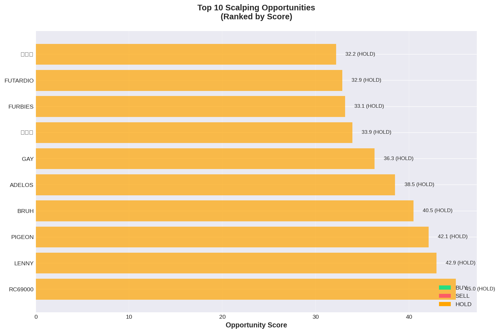
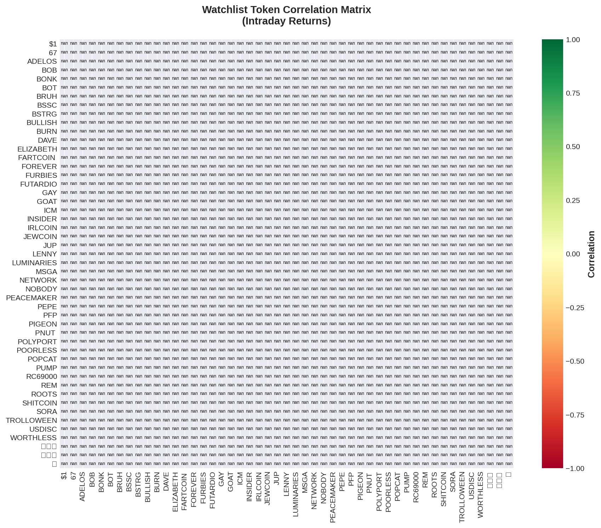

# Solana Scalping Analysis Report
**Date:** 2025-10-14  
**Generated:** 13:50 UTC

---

## 🎯 Top Opportunities

```
======================================================================
🎯 SCALPING OPPORTUNITIES - TODAY
======================================================================

✅ Loaded 22 snapshots (1244 datapoints)
📊 Top 20 tokens ranked by opportunity score:

 1. 📌 ADELOS   🟡 HOLD 
    Price: $0.00008181
    Volatility:  20.8% | Momentum:  -66.3% | Volume:    -5%
    Signal Strength: 0.0/5.0
    Score: 41.7

 2. 📌 PIGEON   🟡 HOLD 
    Price: $0.00010320
    Volatility:   8.2% | Momentum:  +75.6% | Volume:    -3%
    Signal Strength: 0.0/5.0
    Score: 40.9

 3. 📌 BRUH     🟡 HOLD 
    Price: $0.00012630
    Volatility:  18.2% | Momentum:  +63.3% | Volume:    +2%
    Signal Strength: 0.0/5.0
    Score: 40.4

 4. 📌 GAY      🟡 HOLD 
    Price: $0.00000678
    Volatility:  18.1% | Momentum:  -62.4% | Volume:    +1%
    Signal Strength: 0.0/5.0
    Score: 40.1

 5. 📌 LENNY    🟡 HOLD 
    Price: $0.00129900
    Volatility:  29.4% | Momentum:  +40.8% | Volume:   +21%
    Signal Strength: 0.0/5.0
    Score: 37.9

 6. 📌 中华币      🟡 HOLD 
    Price: $0.00001168
    Volatility:  15.7% | Momentum:  -53.6% | Volume:    +1%
    Signal Strength: 0.0/5.0
    Score: 37.3

 7. 📌 🟩⬜️      🟡 HOLD 
    Price: $0.00010910
    Volatility:  16.3% | Momentum:  -44.8% | Volume:    +4%
    Signal Strength: 0.0/5.0
    Score: 35.3

 8. 📌 FUTARDIO 🟡 HOLD 
    Price: $0.00087540
    Volatility:  11.8% | Momentum:  +34.4% | Volume:   +10%
    Signal Strength: 0.0/5.0
    Score: 31.7

 9. 📌 PEACEMAK 🟡 HOLD 
    Price: $0.00008528
    Volatility:  23.3% | Momentum:  -21.7% | Volume:   -11%
    Signal Strength: 0.0/5.0
    Score: 31.1

10. 📌 RC69000  🟡 HOLD 
    Price: $0.00009296
    Volatility:  37.5% | Momentum:   +4.1% | Volume:    +4%
    Signal Strength: 0.0/5.0
    Score: 30.5

11. 📌 DAVE     🟡 HOLD 
    Price: $0.00015530
    Volatility:   7.3% | Momentum:  -30.5% | Volume:    +4%
    Signal Strength: 0.0/5.0
    Score: 29.5

12. 📌 FOREVER  🟡 HOLD 
    Price: $0.00045920
    Volatility:   6.6% | Momentum:  +29.0% | Volume:    +1%
    Signal Strength: 0.0/5.0
    Score: 28.9

13. 📌 POORLESS 🟡 HOLD 
    Price: $0.00001539
    Volatility:   9.7% | Momentum:  -26.2% | Volume:   -12%
    Signal Strength: 0.0/5.0
    Score: 28.8

14. 📌 BOT      🟡 HOLD 
    Price: $0.00772900
    Volatility:   5.7% | Momentum:  -20.6% | Volume:   +11%
    Signal Strength: 0.0/5.0
    Score: 26.7

15. 📌 BOB      🟡 HOLD 
    Price: $0.00002975
    Volatility:  17.9% | Momentum:   +8.9% | Volume:    +0%
    Signal Strength: 0.0/5.0
    Score: 26.7

16. 📌 NETWORK  🟡 HOLD 
    Price: $0.00014640
    Volatility:  16.0% | Momentum:  +10.2% | Volume:    +4%
    Signal Strength: 0.0/5.0
    Score: 26.6

17. 📌 BULLISH  🟡 HOLD 
    Price: $0.00827500
    Volatility:  10.5% | Momentum:  +13.5% | Volume:    +4%
    Signal Strength: 0.0/5.0
    Score: 26.0

18. 📌 FURBIES  🟡 HOLD 
    Price: $0.00036190
    Volatility:   7.3% | Momentum:  +15.8% | Volume:    -4%
    Signal Strength: 0.0/5.0
    Score: 25.7

19. 📌 67       🟡 HOLD 
    Price: $0.00106500
    Volatility:   5.5% | Momentum:  +16.2% | Volume:    +2%
    Signal Strength: 0.0/5.0
    Score: 25.5

20. 📌 🟪        🟡 HOLD 
    Price: $0.00029750
    Volatility:  12.8% | Momentum:   -8.5% | Volume:    +3%
    Signal Strength: 0.0/5.0
    Score: 25.4

======================================================================
Legend: 📌 Watchlist | 🆕 Dynamic | 🟢 Buy | 🔴 Sell | 🟡 Hold
======================================================================
```




---

## 📋 Watchlist Performance

```
======================================================================
📋 WATCHLIST PERFORMANCE - TODAY
======================================================================

✅ Loaded 22 snapshots (1244 datapoints)
📊 49 watchlist tokens tracked today:

🟢 TOP GAINERS
  FUTARDIO +162.25% @ $0.00087540
  POLYPORT +41.03% @ $0.00088270
  LENNY    +35.75% @ $0.00129900
  USDISC   +35.46% @ $0.00000697
  BRUH     +34.61% @ $0.00012630

🔴 TOP LOSERS
  PEACEMAK -70.04% @ $0.00008528
  RC69000  -73.54% @ $0.00009296
  中华币      -88.73% @ $0.00001168
  GAY      -89.31% @ $0.00000678
  ADELOS   -96.16% @ $0.00008181

📈 STATS
  Average Change: -15.60%
  Median Change: -15.97%
  Gainers: 10
  Losers: 38

======================================================================
```

### Correlation Heatmap



---

## 🔬 Backtesting Results (7-day)

```
🔄 Backtesting 2 tokens over 7 days...

✅ Loaded 22 snapshots (1244 datapoints)
✅ Loaded 1244 datapoints for 2025-10-14
✅ Loaded 38 snapshots (1473 datapoints)
✅ Loaded 1473 datapoints for 2025-10-13
✅ Loaded 47 snapshots (493 datapoints)
✅ Loaded 493 datapoints for 2025-10-12
✅ Loaded 14 snapshots (25 datapoints)
✅ Loaded 25 datapoints for 2025-10-11
❌ No data for 2025-10-10
❌ No data for 2025-10-10
❌ No data for 2025-10-09
❌ No data for 2025-10-09
❌ No data for 2025-10-08
❌ No data for 2025-10-08
✅ Loaded 4 days of data: 2025-10-11 to 2025-10-14
   Total datapoints: 3235

  [1/2] Testing JUPyiwrYJFsk...
    ❌ Error: 'signal'
  [2/2] Testing 9BB6NFEcjBCt...
    ❌ Error: 'signal'

❌ No trades
✅ Results saved: reports/backtest_results.json
```


---

## 📊 How to Use

### Signal Interpretation
- 🟢 **BUY**: High volatility + positive momentum + volume surge
- 🔴 **SELL**: Momentum reversal or volume decline
- 🟡 **HOLD**: Low volatility or neutral conditions

### Signal Strength
- **0-2**: Weak signal, high risk
- **2-3**: Moderate signal, medium risk
- **3-4**: Strong signal, lower risk
- **4-5**: Very strong signal, best opportunities

### Opportunity Score
Composite score based on:
- Volatility (30%)
- Momentum (30%)
- Volume (20%)
- Signal strength (20%)
- Watchlist bonus (+20 if tracked)

### Recommendations
1. Focus on watchlist tokens (📌) - more reliable data
2. Look for signal strength ≥3.0
3. Confirm with volume momentum
4. Check support/resistance levels before entry

---

**Next Update:** In 30 minutes  
**Data Source:** [Intraday Snapshots](https://github.com/stelios5791/sol-reports/tree/main/intraday)
