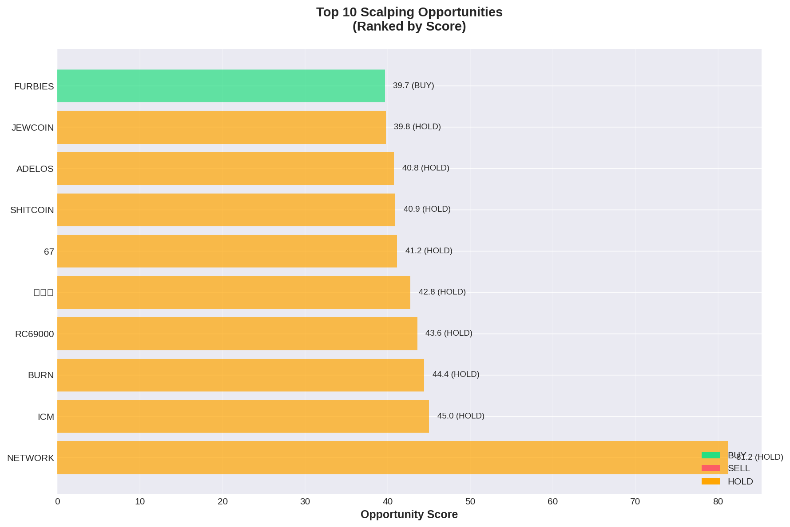

# Solana Scalping Analysis Report
**Date:** 2025-10-14  
**Generated:** 16:23 UTC

---

## 🎯 Top Opportunities

```
======================================================================
🎯 SCALPING OPPORTUNITIES - TODAY
======================================================================

✅ Loaded 27 snapshots (1526 datapoints)
📊 Top 20 tokens ranked by opportunity score:

 1. 📌 NETWORK  🟡 HOLD 
    Price: $0.00033190
    Volatility:  14.5% | Momentum: +166.8% | Volume:    +7%
    Signal Strength: 0.0/5.0
    Score: 65.4

 2. 📌 BURN     🟡 HOLD ⭐⭐
    Price: $0.00011420
    Volatility:  21.3% | Momentum:  -44.6% | Volume:   -15%
    Signal Strength: 3.9/5.0
    Score: 45.9

 3. 📌 ICM      🟡 HOLD ⭐⭐⭐
    Price: $0.00043570
    Volatility:  13.4% | Momentum:  +37.0% | Volume:    +1%
    Signal Strength: 4.8/5.0
    Score: 44.7

 4. 📌 FURBIES  🟡 HOLD ⭐⭐⭐
    Price: $0.00044530
    Volatility:  13.0% | Momentum:  +28.8% | Volume:    -3%
    Signal Strength: 4.6/5.0
    Score: 41.9

 5. 📌 LUMINARI 🟡 HOLD ⭐⭐⭐
    Price: $0.00008003
    Volatility:   7.2% | Momentum:  +29.8% | Volume:    -0%
    Signal Strength: 4.8/5.0
    Score: 41.4

 6. 📌 SHITCOIN 🟡 HOLD ⭐⭐⭐
    Price: $0.00107600
    Volatility:   9.2% | Momentum:  +22.8% | Volume:    -5%
    Signal Strength: 4.8/5.0
    Score: 40.0

 7. 📌 ADELOS   🟡 HOLD ⭐⭐
    Price: $0.00010320
    Volatility:  22.9% | Momentum:  +22.0% | Volume:    -4%
    Signal Strength: 3.2/5.0
    Score: 39.3

 8. 📌 67       🟡 HOLD ⭐⭐⭐
    Price: $0.00123200
    Volatility:   5.5% | Momentum:  +20.0% | Volume:    +1%
    Signal Strength: 4.8/5.0
    Score: 38.5

 9. 📌 FOREVER  🟡 HOLD 
    Price: $0.00071440
    Volatility:   3.9% | Momentum:  +68.8% | Volume:    +4%
    Signal Strength: 0.0/5.0
    Score: 38.2

10. 📌 🟩⬜️      🟡 HOLD ⭐⭐
    Price: $0.00009152
    Volatility:  12.4% | Momentum:  -27.8% | Volume:    +2%
    Signal Strength: 3.2/5.0
    Score: 38.2

11. 📌 LENNY    🟢 BUY ⭐⭐⭐
    Price: $0.00127800
    Volatility:   9.6% | Momentum:   +6.4% | Volume:    +4%
    Quality: 100/100 | Confluence: 3 indicators | R/R: 1.3:1
    Score: 38.1

12. 📌 BOB      🟡 HOLD ⭐⭐
    Price: $0.00002048
    Volatility:  12.0% | Momentum:  -26.1% | Volume:   -22%
    Signal Strength: 3.5/5.0
    Score: 38.0

13. 📌 BSTRG    🟡 HOLD 
    Price: $0.00044010
    Volatility:  18.7% | Momentum:  +51.0% | Volume:   +26%
    Signal Strength: 0.0/5.0
    Score: 37.8

14. 📌 JEWCOIN  🟡 HOLD ⭐⭐
    Price: $0.00009055
    Volatility:  14.5% | Momentum:  -22.1% | Volume:    -1%
    Signal Strength: 3.2/5.0
    Score: 37.3

15. 📌 RC69000  🟡 HOLD ⭐⭐
    Price: $0.00010890
    Volatility:  29.3% | Momentum:   +4.2% | Volume:    +2%
    Signal Strength: 3.2/5.0
    Score: 36.6

16. 📌 ROOTS    🟡 HOLD ⭐⭐
    Price: $0.00013580
    Volatility:  13.9% | Momentum:  -17.3% | Volume:    -4%
    Signal Strength: 3.5/5.0
    Score: 36.5

17. 📌 FUTARDIO 🟡 HOLD ⭐⭐⭐
    Price: $0.00073230
    Volatility:   6.5% | Momentum:  -18.0% | Volume:    +6%
    Signal Strength: 4.0/5.0
    Score: 36.2

18. 📌 SORA     🟡 HOLD ⭐⭐⭐
    Price: $0.00078720
    Volatility:   3.2% | Momentum:  +17.2% | Volume:    +2%
    Signal Strength: 4.2/5.0
    Score: 35.8

19. 📌 IRLCOIN  🟡 HOLD ⭐⭐⭐
    Price: $0.00053730
    Volatility:   5.2% | Momentum:  +11.7% | Volume:    -9%
    Signal Strength: 4.6/5.0
    Score: 35.6

20. 📌 BULLISH  🟡 HOLD ⭐⭐⭐
    Price: $0.00812500
    Volatility:   5.5% | Momentum:   +7.2% | Volume:    +2%
    Signal Strength: 4.8/5.0
    Score: 35.3

======================================================================
Legend: 📌 Watchlist | 🆕 Dynamic | 🟢 Buy | 🔴 Sell | 🟡 Hold
======================================================================
```




---

## 📋 Watchlist Performance

```
======================================================================
📋 WATCHLIST PERFORMANCE - TODAY
======================================================================

✅ Loaded 27 snapshots (1526 datapoints)
📊 50 watchlist tokens tracked today:

🟢 TOP GAINERS
  FUTARDIO +119.38% @ $0.00073230
  DOG      +66.06% @ $0.00013610
  NETWORK  +59.34% @ $0.00033190
  BSTRG    +50.98% @ $0.00044010
  POLYPORT +49.59% @ $0.00093630

🔴 TOP LOSERS
  BURN     -73.19% @ $0.00011420
  PEACEMAK -75.65% @ $0.00006930
  中华币      -90.09% @ $0.00001027
  GAY      -90.82% @ $0.00000582
  ADELOS   -95.16% @ $0.00010320

📈 STATS
  Average Change: -8.52%
  Median Change: -5.84%
  Gainers: 15
  Losers: 34

======================================================================
```

### Correlation Heatmap


---

## 🔬 Backtesting Results (7-day)

```
🔄 Backtesting 2 tokens over 7 days...

✅ Loaded 27 snapshots (1526 datapoints)
✅ Loaded 1526 datapoints for 2025-10-14
✅ Loaded 38 snapshots (1473 datapoints)
✅ Loaded 1473 datapoints for 2025-10-13
✅ Loaded 47 snapshots (493 datapoints)
✅ Loaded 493 datapoints for 2025-10-12
✅ Loaded 14 snapshots (25 datapoints)
✅ Loaded 25 datapoints for 2025-10-11
❌ No data for 2025-10-10
❌ No data for 2025-10-10
❌ No data for 2025-10-09
❌ No data for 2025-10-09
❌ No data for 2025-10-08
❌ No data for 2025-10-08
✅ Loaded 4 days of data: 2025-10-11 to 2025-10-14
   Total datapoints: 3517

  [1/2] Testing JUPyiwrYJFsk...
    ❌ Error: 'signal'
  [2/2] Testing 9BB6NFEcjBCt...
    ❌ Error: 'signal'

❌ No trades
✅ Results saved: reports/backtest_results.json
```


---

## 📊 How to Use

### Signal Interpretation
- 🟢 **BUY**: High volatility + positive momentum + volume surge
- 🔴 **SELL**: Momentum reversal or volume decline
- 🟡 **HOLD**: Low volatility or neutral conditions

### Signal Strength
- **0-2**: Weak signal, high risk
- **2-3**: Moderate signal, medium risk
- **3-4**: Strong signal, lower risk
- **4-5**: Very strong signal, best opportunities

### Opportunity Score
Composite score based on:
- Volatility (30%)
- Momentum (30%)
- Volume (20%)
- Signal strength (20%)
- Watchlist bonus (+20 if tracked)

### Recommendations
1. Focus on watchlist tokens (📌) - more reliable data
2. Look for signal strength ≥3.0
3. Confirm with volume momentum
4. Check support/resistance levels before entry

---

**Next Update:** In 30 minutes  
**Data Source:** [Intraday Snapshots](https://github.com/stelios5791/sol-reports/tree/main/intraday)
