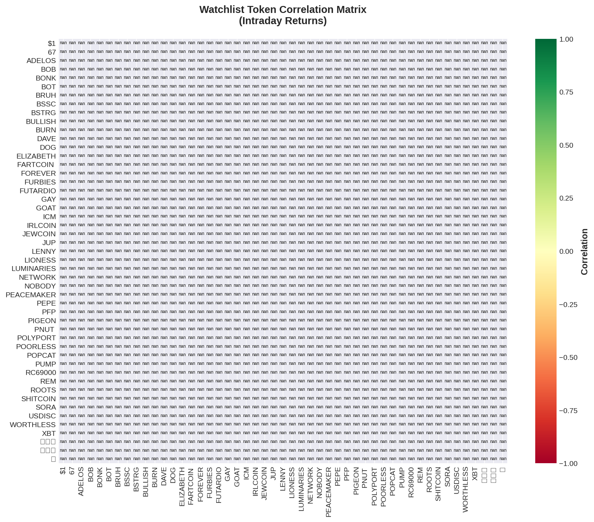

# Solana Scalping Analysis Report
**Date:** 2025-10-14  
**Generated:** 16:48 UTC

---

## 🎯 Top Opportunities

```
======================================================================
🎯 SCALPING OPPORTUNITIES - TODAY
======================================================================

✅ Loaded 28 snapshots (1580 datapoints)
📊 Top 20 tokens ranked by opportunity score:

 1. 📌 NETWORK  🟡 HOLD ⭐⭐⭐
    Price: $0.00041520
    Volatility:  14.7% | Momentum: +183.6% | Volume:    +9%
    Signal Strength: 4.6/5.0
    Score: 81.2

 2. 📌 ICM      🟡 HOLD ⭐⭐⭐
    Price: $0.00044140
    Volatility:  13.1% | Momentum:  +40.8% | Volume:    +3%
    Signal Strength: 4.6/5.0
    Score: 45.0

 3. 📌 BURN     🟡 HOLD ⭐
    Price: $0.00010480
    Volatility:  20.8% | Momentum:  -50.3% | Volume:   -16%
    Signal Strength: 2.8/5.0
    Score: 44.4

 4. 📌 RC69000  🟡 HOLD ⭐⭐⭐
    Price: $0.00011600
    Volatility:  28.4% | Momentum:  +24.8% | Volume:    +2%
    Signal Strength: 4.1/5.0
    Score: 43.6

 5. 📌 🟩⬜️      🟡 HOLD ⭐⭐
    Price: $0.00006317
    Volatility:  16.3% | Momentum:  -42.1% | Volume:    +3%
    Signal Strength: 3.2/5.0
    Score: 42.8

 6. 📌 67       🟡 HOLD ⭐⭐⭐
    Price: $0.00137300
    Volatility:   6.3% | Momentum:  +32.4% | Volume:    -2%
    Signal Strength: 4.6/5.0
    Score: 41.2

 7. 📌 SHITCOIN 🟡 HOLD ⭐⭐⭐
    Price: $0.00111700
    Volatility:   9.1% | Momentum:  +26.4% | Volume:    -4%
    Signal Strength: 4.8/5.0
    Score: 40.9

 8. 📌 ADELOS   🟡 HOLD ⭐⭐
    Price: $0.00010480
    Volatility:  22.6% | Momentum:  +28.1% | Volume:    -3%
    Signal Strength: 3.2/5.0
    Score: 40.8

 9. 📌 JEWCOIN  🟡 HOLD ⭐⭐
    Price: $0.00008163
    Volatility:  14.8% | Momentum:  -26.1% | Volume:    -4%
    Signal Strength: 3.9/5.0
    Score: 39.8

10. 📌 FURBIES  🟢 BUY ⭐⭐⭐
    Price: $0.00039160
    Volatility:  14.7% | Momentum:   +8.2% | Volume:    -5%
    Quality: 100/100 | Confluence: 3 indicators | R/R: 1.5:1
    Score: 39.7

11. 📌 LUMINARI 🟡 HOLD ⭐⭐⭐
    Price: $0.00007508
    Volatility:   8.4% | Momentum:  +21.3% | Volume:    +0%
    Signal Strength: 4.8/5.0
    Score: 39.6

12. 📌 BOB      🟡 HOLD ⭐⭐
    Price: $0.00002062
    Volatility:  11.0% | Momentum:  -30.7% | Volume:   -31%
    Signal Strength: 3.5/5.0
    Score: 38.7

13. 📌 LENNY    🟢 BUY ⭐⭐⭐
    Price: $0.00136400
    Volatility:   9.4% | Momentum:   +5.0% | Volume:    +3%
    Quality: 100/100 | Confluence: 3 indicators | R/R: 0.9:1
    Score: 37.7

14. 📌 ROOTS    🟡 HOLD ⭐⭐
    Price: $0.00012570
    Volatility:  14.1% | Momentum:  -20.8% | Volume:    -2%
    Signal Strength: 3.5/5.0
    Score: 37.4

15. 📌 FUTARDIO 🟡 HOLD ⭐⭐⭐
    Price: $0.00071180
    Volatility:   6.5% | Momentum:  -18.7% | Volume:    +5%
    Signal Strength: 4.0/5.0
    Score: 36.4

16. 📌 BOT      🟡 HOLD ⭐⭐⭐
    Price: $0.00919900
    Volatility:   4.8% | Momentum:  +19.0% | Volume:    +2%
    Signal Strength: 4.0/5.0
    Score: 36.0

17. 📌 67       🟡 HOLD ⭐⭐⭐
    Price: $0.00119000
    Volatility:   3.7% | Momentum:  +11.7% | Volume:    -1%
    Signal Strength: 4.6/5.0
    Score: 35.3

18. 📌 IRLCOIN  🟡 HOLD ⭐⭐⭐
    Price: $0.00053070
    Volatility:   5.3% | Momentum:   +8.3% | Volume:   -13%
    Signal Strength: 4.8/5.0
    Score: 35.3

19. 📌 PEACEMAK 🟡 HOLD ⭐⭐
    Price: $0.00006918
    Volatility:  10.0% | Momentum:  -18.9% | Volume:   -16%
    Signal Strength: 3.2/5.0
    Score: 35.1

20. 📌 BRUH     🟡 HOLD ⭐⭐⭐
    Price: $0.00013180
    Volatility:   8.3% | Momentum:   +4.4% | Volume:    +4%
    Signal Strength: 4.6/5.0
    Score: 34.7

======================================================================
Legend: 📌 Watchlist | 🆕 Dynamic | 🟢 Buy | 🔴 Sell | 🟡 Hold
======================================================================
```


---

## 📋 Watchlist Performance

```
======================================================================
📋 WATCHLIST PERFORMANCE - TODAY
======================================================================

✅ Loaded 28 snapshots (1580 datapoints)
📊 49 watchlist tokens tracked today:

🟢 TOP GAINERS
  FUTARDIO +113.24% @ $0.00071180
  NETWORK  +99.33% @ $0.00041520
  LENNY    +42.54% @ $0.00136400
  USDISC   +41.93% @ $0.00000730
  POLYPORT +40.60% @ $0.00088000

🔴 TOP LOSERS
  BURN     -75.39% @ $0.00010480
  PEACEMAK -75.69% @ $0.00006918
  GAY      -90.82% @ $0.00000582
  中华币      -91.30% @ $0.00000901
  ADELOS   -95.08% @ $0.00010480

📈 STATS
  Average Change: -10.53%
  Median Change: -8.01%
  Gainers: 17
  Losers: 31

======================================================================
```

### Correlation Heatmap



---

## 🔬 Backtesting Results (7-day)

```
🔄 Backtesting 2 tokens over 7 days...

✅ Loaded 28 snapshots (1580 datapoints)
✅ Loaded 1580 datapoints for 2025-10-14
✅ Loaded 38 snapshots (1473 datapoints)
✅ Loaded 1473 datapoints for 2025-10-13
✅ Loaded 47 snapshots (493 datapoints)
✅ Loaded 493 datapoints for 2025-10-12
✅ Loaded 14 snapshots (25 datapoints)
✅ Loaded 25 datapoints for 2025-10-11
❌ No data for 2025-10-10
❌ No data for 2025-10-10
❌ No data for 2025-10-09
❌ No data for 2025-10-09
❌ No data for 2025-10-08
❌ No data for 2025-10-08
✅ Loaded 4 days of data: 2025-10-11 to 2025-10-14
   Total datapoints: 3571

  [1/2] Testing JUPyiwrYJFsk...
    ❌ Error: 'signal'
  [2/2] Testing 9BB6NFEcjBCt...
    ❌ Error: 'signal'

❌ No trades
✅ Results saved: reports/backtest_results.json
```


---

## 📊 How to Use

### Signal Interpretation
- 🟢 **BUY**: High volatility + positive momentum + volume surge
- 🔴 **SELL**: Momentum reversal or volume decline
- 🟡 **HOLD**: Low volatility or neutral conditions

### Signal Strength
- **0-2**: Weak signal, high risk
- **2-3**: Moderate signal, medium risk
- **3-4**: Strong signal, lower risk
- **4-5**: Very strong signal, best opportunities

### Opportunity Score
Composite score based on:
- Volatility (30%)
- Momentum (30%)
- Volume (20%)
- Signal strength (20%)
- Watchlist bonus (+20 if tracked)

### Recommendations
1. Focus on watchlist tokens (📌) - more reliable data
2. Look for signal strength ≥3.0
3. Confirm with volume momentum
4. Check support/resistance levels before entry

---

**Next Update:** In 30 minutes  
**Data Source:** [Intraday Snapshots](https://github.com/stelios5791/sol-reports/tree/main/intraday)
